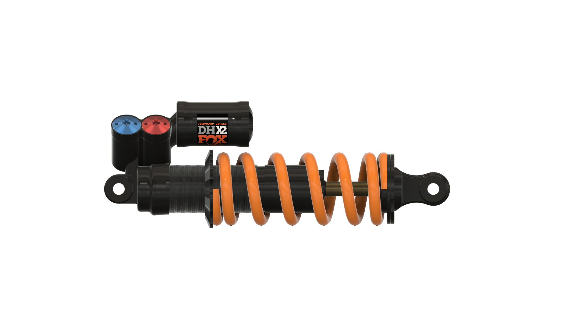

# Heli_gen

Create a variable pitch and/or variable radius helix (for a spring, for example).

If the helix already exists, it will be animated e.g.

[Animated spring](https://www.youtube.com/watch?v=XvCJyeNAlBs)

[Animated coil shock](https://www.youtube.com/watch?v=zO7yg0AiWvA)
