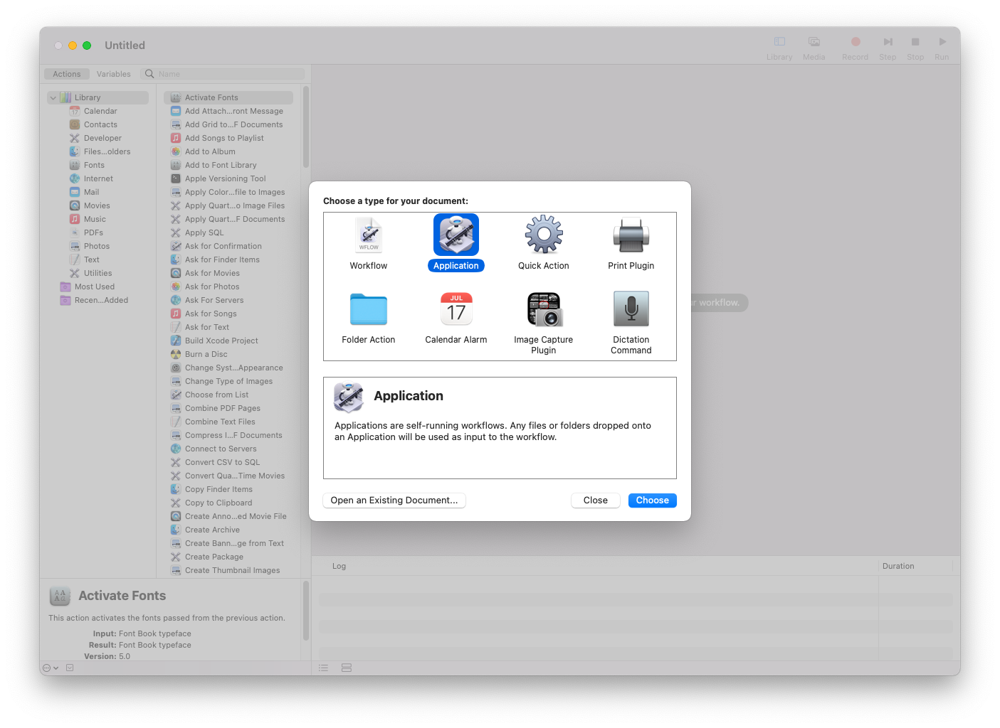
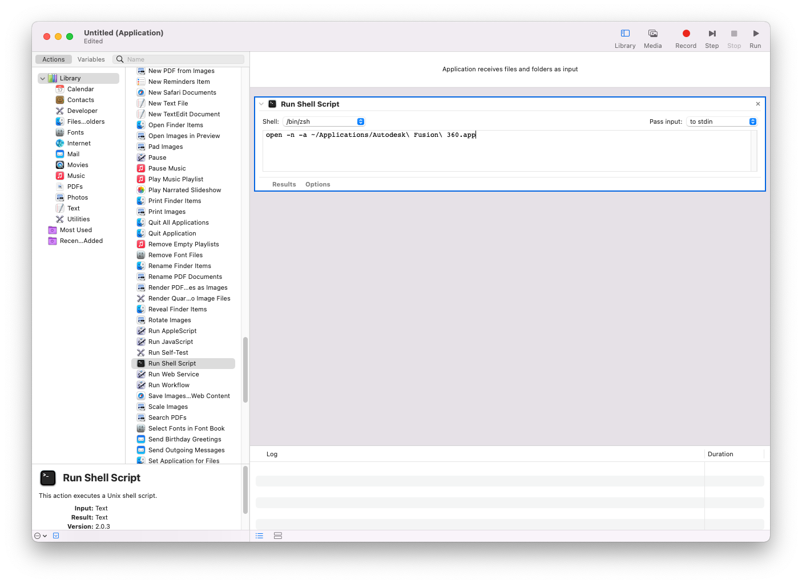
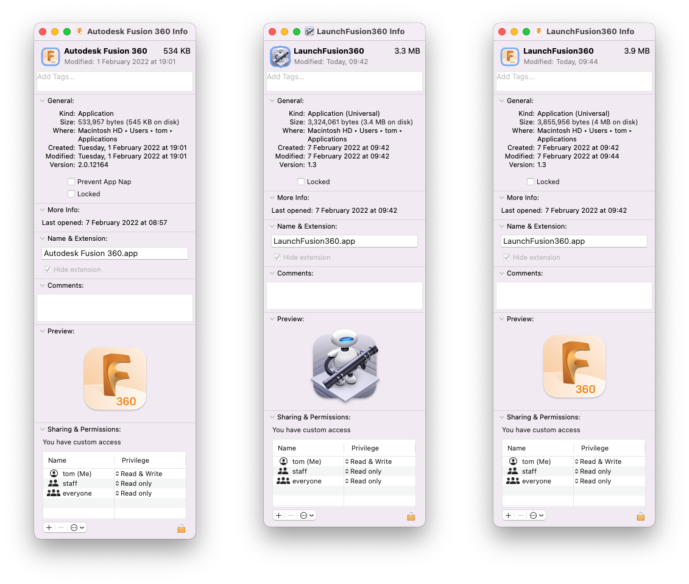

# Launch Fusion360

Open multiple Fusion 360 applications in MacOS

## Option 1 - launch Fusion 360 from Terminal
Run the following command in Terminal
```
open -n -a ~/Applications/Autodesk\ Fusion\ 360.app
```

## Option 2 - launch Fusion 360 with a shell script
Create a shell script e.g. *LaunchFusion360.sh*
```
#!/bin/bash

open -n -a ~/Applications/Autodesk\ Fusion\ 360.app
```
Make it executable with
```
chmod +x LaunchFusion360.sh
```
Run it in Terminal with
```
./LaunchFusion360.sh
```
or
```
~/Applications/LaunchFusion360.sh
```
depending where it is.

## Option 3 - use Automator to create an application based on the same command
Open *Automator* and create a new application

Drag in the *Run Shell Script* action

Add the `open -n -a ~/Applications/Autodesk\ Fusion\ 360.app` line from above

Save the application as, for example, *LaunchFusion360* in *~/Applications/*
### Change the application icon (optional)
- Right-click on the new application (e.g. *LaunchFusion360*) and choose *Get info*
- Similarly, right-click and *Get info* on the *Autodesk Fusion 360* application
- Select the icon in the top-left of the *Autodesk Fusion 360* info window and copy it with *Cmd+C*
- Select the icon in the top-left of the *LaunchFusion360* info window and paste it with *Cmd+V*

- Use the new application to open Fusion 360 from Launchpad, Dock etc
